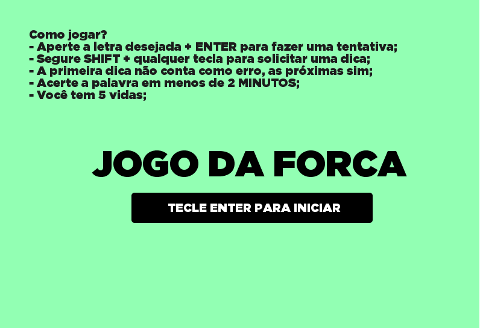

# Jogo da Forca em Portugol Studio 🎮




> Jogo da forca feito no Portugol Studio utilizando gráficos e as bibliotecas da ferramenta.

### ⚙️ Ajustes e melhorias

O projeto ainda está em desenvolvimento e as próximas atualizações serão voltadas nas seguintes tarefas:

- [x] Correção de bugs no menu principal
- [x] Correção de bugs com o teclado
- [x] Criação da tela de dicas
- [ ] Ajustes na tela de derrota
- [ ] Novas palavras e dicas

## 💻 Pré-requisitos

Antes de começar, verifique se você atendeu aos seguintes requisitos:
* Você instalou a versão mais recente de `Portugol Studio`
* Você tem uma máquina `Windows / Linux`.


## ☕ Dicas

Enquanto alguns bugs não são resolvidos, abaixo estão algumas dicas para uma melhor experiência:

```
Siga as dicas da tela inicial.
```

```
Ao perder o jogo, feche e abra novamente.
```

```
O projeto ainda se encontra com alguns bugs, feche e abra novamente se estiver com problemas.
```

```
Edite o arquivo jogo.txt para adicionar/alterar palavras e dicas.
```


[⬆ Voltar ao topo](#nome-do-projeto)<br>